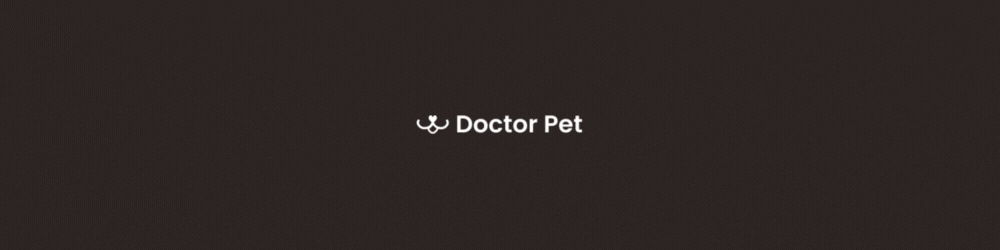

  

## ✨ Tecnologias

Esse projeto foi desenvolvido com as seguintes tecnologias:

-   [HTML5](https://developer.mozilla.org/pt-BR/docs/Learn/HTML)
-   [CSS3](https://developer.mozilla.org/pt-BR/docs/Learn/CSS)
-   [Javascript](https://developer.mozilla.org/pt-BR/docs/Web/JavaScript)
-   [Hover.css](http://ianlunn.github.io/Hover/)
-   [Animate.css](https://animate.style/)
-   [Sass](https://sass-lang.com/)
-   [Bootstrap](https://getbootstrap.com/)
-   [React](https://pt-br.reactjs.org/)
-   [React Router Dom](https://reactrouter.com/en/main)
-   [React Icons](https://react-icons.github.io/react-icons/)
-   [Netlify](https://www.netlify.com/)

## 💻 Descrição do projeto

Só quem tem um animal de estimação sabe que adquirir produtos de boa qualidade é importante para sua longevidade - e felicidade! Além disso, ter a praticidade de fazer sua compra online, com os melhores preços, e receber em casa conta muito! Doctor Pet veio para atender essas demandas, com um atendimento diferenciado - do jeitinho que você sempre quis.

Contamos com uma variedade de produtos selecionados por um equipe apaixonada por pets. Somos um pet shop online completo, com as melhores marcas e os produtos mais recomendados do mundo pet. 

## 🚀 Projeto em desenvolvimento

-   Clone o repositório
-   Instale as dependências com `npm install`
-   Inicie o servidor com `npm start`

Agora você pode acessar [`localhost:3000`](http://localhost:3000) do seu navegador.

## 🚀 Projeto em produção

Acesse [``]() do seu navegador.

## 📄 Licença

Esse projeto está sob a licença MIT. Veja o arquivo [LICENSE](LICENSE.md) para mais detalhes.

